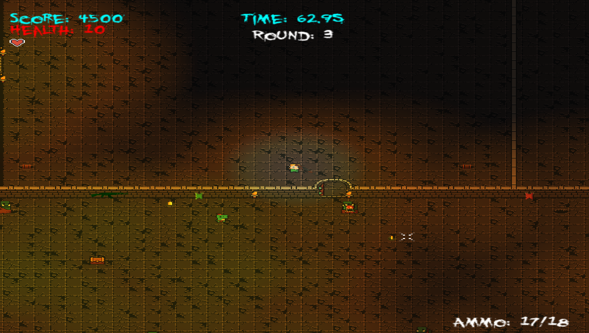
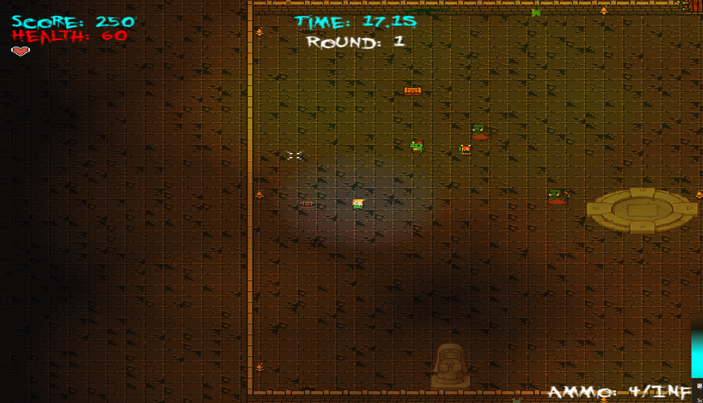
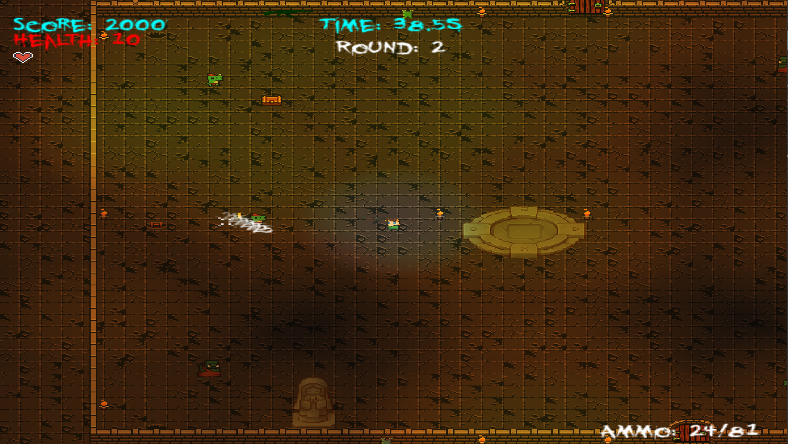
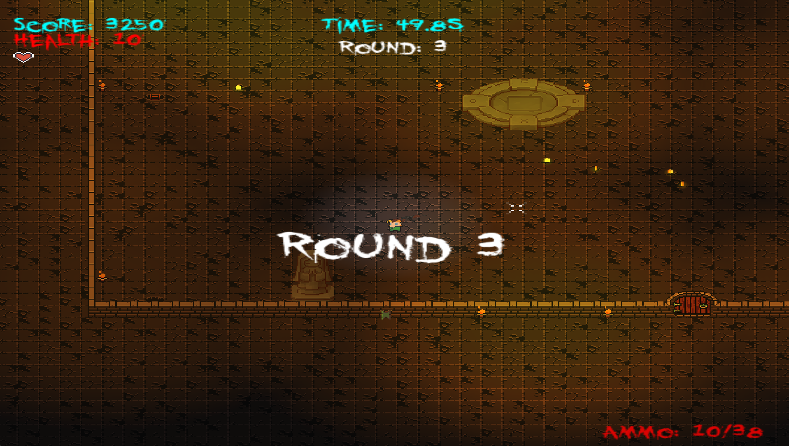

# 2D Roguelike Project (Vampire Survivors-Inspired)

This project is a fast-paced 2D action roguelike inspired by *Vampire Survivors*. Built entirely in C++ using SFML for rendering and Box2D for collision and physics, it leverages a custom, component-based architecture designed to support modular, scalable gameplay systems.

Instead of relying on prebuilt engines like Unity or Unreal, I focused on building core gameplay foundations myself—prioritizing system flexibility, performance optimization, and deep understanding of gameplay engineering challenges.

This project represents an ongoing effort to sharpen my skills in gameplay systems, architecture design, and large-scale enemy management, with many exciting ideas still planned for future development.

---

## Screenshots

https://github.com/user-attachments/assets/3866d9c7-bb4e-4b96-bcb7-b04dce512d70

---

## Features

- **Rendering:** Powered by SFML for sprite rendering, UI, and effects.
- **Physics and Collision:** Integrated Box2D for efficient physics simulation and collision detection.
- **Component-Based Architecture:** Flexible and scalable GameObject system supporting clean separation of behaviors.
- **Dynamic Enemy Management:** Real-time spawning and updating of hundreds of enemies simultaneously with optimized performance.
- **Ability System:** Randomized ability selection with upgrade paths to increase gameplay variety.
- **Combat Systems:** Real-time player attacks, automatic weapon behaviors, and responsive enemy interactions.
- **Debugging Tools:** In-game debugging overlays for live stat tracking, tuning, and visualization using ImGui.

---

## Development Process

The project was developed with the following priorities:

- **Engine Foundation:** Extended and improved the core GameManager and GameObject systems for better gameplay feature support.
- **Scalable Enemy Systems:** Designed the spawn and movement logic to handle hundreds of entities at once without frame rate drops.
- **Procedural Systems:** Implemented randomized upgrade systems and scalable attack logic to maintain high replayability.
- **Combat Flow:** Focused on fluid player feedback through responsive movement, attacks, and hit reactions.
- **Performance Optimization:** Built systems with lightweight updates, object pooling, and careful memory management to maintain real-time performance even under heavy loads.
- **Runtime Tuning:** Developed ImGui tools for real-time inspection and parameter tuning during development and playtesting.

---

## Challenges and Solutions

| Challenge | Solution |
| :-------- | :-------- |
| **Managing Hundreds of Active Entities** | Designed efficient update loops and lightweight component logic to minimize frame cost per entity. |
| **Flexible Ability System** | Built a modular ability selection and upgrade framework, allowing dynamic expansion without major code changes. |
| **Balancing Gameplay Without Full Content** | Used debugging overlays and parameter tuning tools to rapidly iterate on enemy difficulty curves and upgrade effectiveness. |
| **Preventing Tight Coupling Across Systems** | Continued to refine the engine's component-based architecture to isolate rendering, physics, input, and gameplay logic cleanly. |
| **Safe and Efficient GameObject Access** | Developed a custom handle system for GameObjects, enabling safe lookup and passing of references without risking dangling pointers. |
| **Asset Management and Memory Efficiency** | Implemented resource sharing across GameObjects to reduce memory usage and avoid redundant texture loads. |
| **Maintaining Smooth Visual Feedback** | Focused on quick, snappy animations and immediate player responses to input and damage to preserve the high-energy feel. |

---
